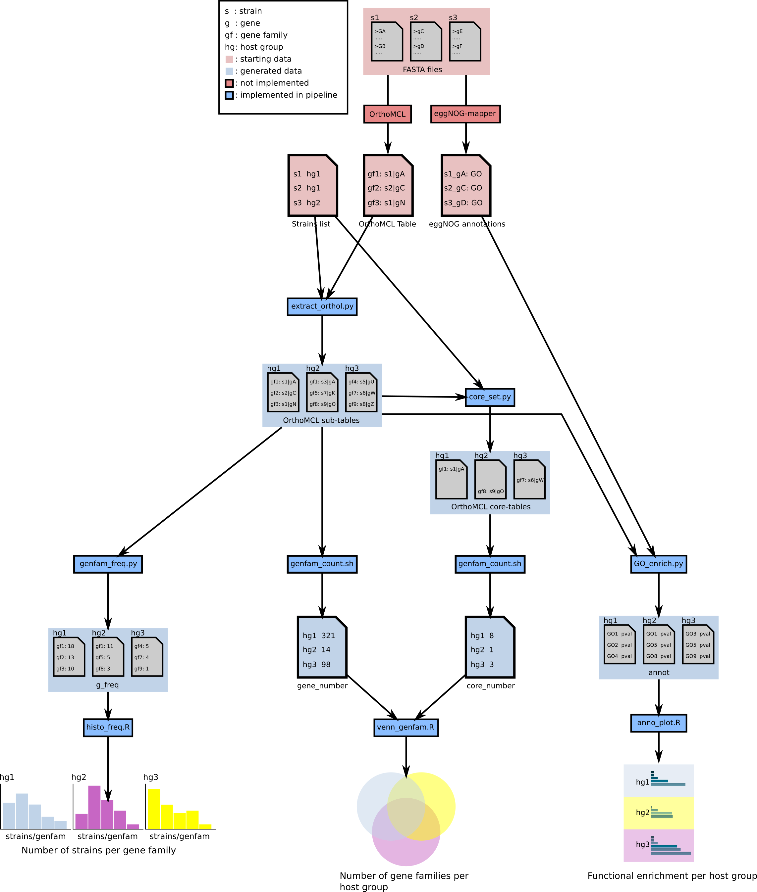

# Host-specific gene content of bumblebee and honeybee gut bacteria
## Sequence a Genome 2, Group 4
### Laurent Casini and Cyril Matthey-Doret
### Supervised by Olivier Emery

In this project, we analyse the gene content of various Lactobacillus strains and investigate what genes are specific to bumblebee and honeybee hosts.

This repository contains the code required to re-run the analysis of host specific gene content.

To run the analysis from scratch, simply ```cd``` to the main directory and type `make` on the command line. The Makefile dependency tree is illustrated at the end of the README.

### dependencies:
* [Python 2](https://www.python.org/) with the following packages installed:
  + [numpy](http://www.numpy.org/)
  + [pandas](http://pandas.pydata.org/pandas-docs/stable/index.html)
  + [scipy](https://www.scipy.org/install.html)
  + [MySQLdb](http://mysql-python.sourceforge.net/MySQLdb.html)
  + [BioPython](http://biopython.org/)

* [R 3.3.x](https://www.r-project.org/):
  + [VennDiagram](https://cran.r-project.org/web/packages/VennDiagram/index.html)
  + [ggplot2](http://ggplot2.org/)
  + [gridExtra](https://cran.r-project.org/web/packages/gridExtra/index.html)

* A UNIX environment with a bash shell and common tools available, such as Makefile.

### scripts:
* `extract_orthol.py`: Takes a list of strains (`strain_list`) and an orthoMCL table (`mclOutput`) as inputs. Categorizes gene families depending on the host in which their are present. It outputs a new ortholog table for each combination of hosts (B, BH, BHO, H, HO and O) and each of these table contains the subset of gene famiilies found in strains from the corresponding hosts. It also includes unique genes (without homologs) in the respective groups.

* `core_set.py`: Takes the same inputs as `extract_orthol.py`. Also outputs one ortholog table per host combination. Each ortholog table contains gene families that are "core" to the group, i.e. gene families present in every single strain of the concerned group.

* `genfam_count.sh`: Takes an input filename pattern and and output filename as input. This script counts the number of line in the input files and outputs a table with the number of lines of each filename. It is used to count both the number of gene families and core set in each category.


* `venn_genfam.R`: Takes two table generated by `genfam_count.sh` as input: one for the gene families per category and one for the core sets. It then constructs a venn diagram showing the different host combinations and their respective number of gene families and core sets.

* `genfam_freq.py`: Computes the "frequencies" of gene families given the orthoMCL table of a host group. The frequency is defined as the number of strains in which a given gene family is present.

* `histo_freq.R`: Produces a histogram given the list of gene families 'frequencies' for a given host group.

* `GO_enrich.py`: Extracts meaningful biological annotations from GO term given by eggNOG-mapper, for a given host group and performs Fisher's exact test to test foc enrichment of GO terms. Biological terms corresponding to the GO terms are then retrieved from the EBI mirror of the gene ontology database by sending SQL requests and entries with significant Benjamini-Hochberg-corrected p-values are written to a file.

* `anno_plot.R`: Generates barplots to visualize the odd ratios of significantly enriched annotation terms in the different host groups.

* `archive`: Previous or alternative versions of script that are not used in the final analysis or in the Makefile.
  + `coreGenome.py`: Alternative version of `extract_orthol.py` with the same function. Does not take a list of strain as input as it is hard-coded in the script.
  + `ortholog_annotator.R`: Script extracting annotations from concatenated RAST output and linking them to the different host groups. Since RAST annotations were only available for some strains, we dropped it and used eggNOG-mapper annotations instead.

### data:
* `mclOutput`: OrthoMCL table containing gene families of all Lactobacillus strains considered here
* `strain_list`: List of all strains with their orthoMCL ID, genbank accession number, host (honeybee (H), bumblebee (B) or Outgroup (O))
`genomes`: Folder containing a fasta file for each strain with all of its genes
* `eggNOG_all_annotations`: File containing annotation data for all genes of all strains together. This file was produced using [eggNOG-mapper](http://eggnogdb.embl.de/#/app/emapper)
* `eggNOG_parameters`: List of parameters used when running eggNOG-mapper for annotating all strains.

### Dependency tree:

Below is a graphical representation of the relationship between data files and scripts showing which files depend on which. This dependency tree illustrates in what order Makefile will run the different components of the pipeline.


